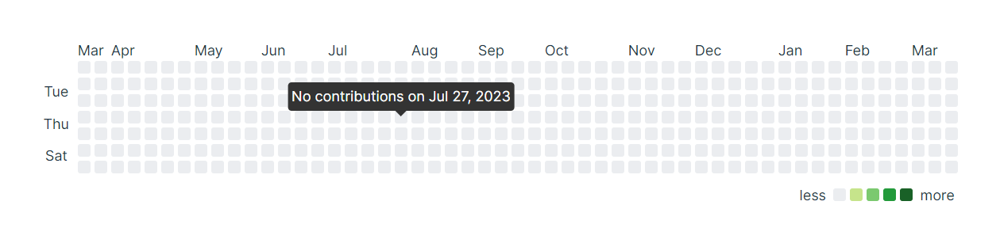

# contribution-map

## Use Method

-   导入组件

```vue
<template>
    <ContributionMap :contributionData="contributionData"></ContributionMap>
</template>
<script setup>
import ContributionMap from './components/map.vue';
const contributionData = [
    {
        count: 1,
        create_time: '2024-01-01',
    },
    {
        count: 1,
        create_time: '2024-01-07',
    },
    {
        count: 48,
        create_time: '2024-03-17',
    },
    {
        count: 1,
        create_time: '2024-01-05',
    },
    {
        count: 1,
        create_time: '2024-01-09',
    },
];
</script>
```


